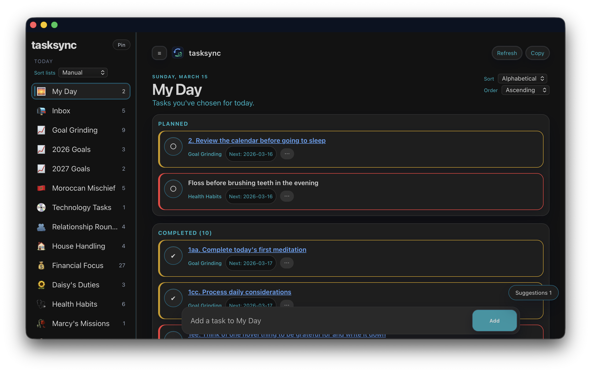
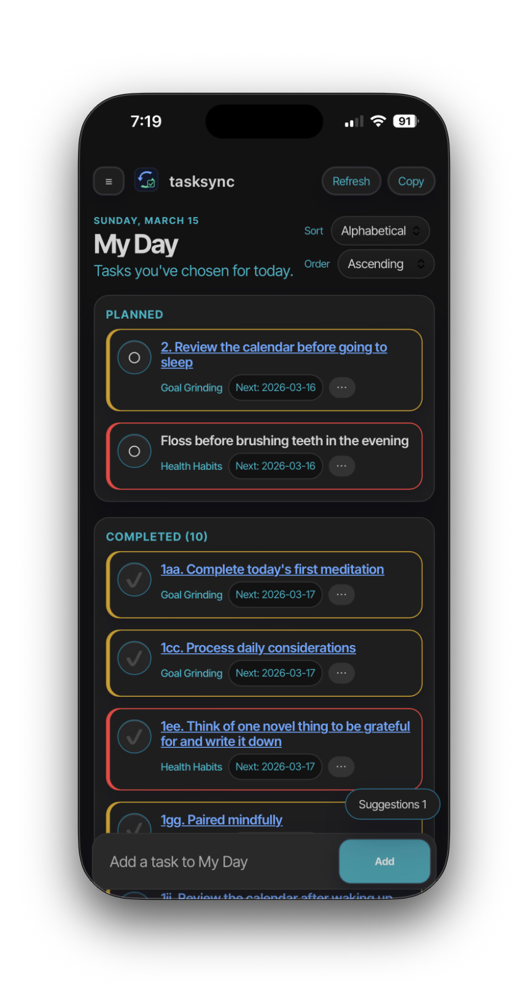

# tasksync

tasksync is a cross-platform, self-hosted task management system built for speed, privacy, and flexibility.

<p align="center">
    
</p>

<table>
    <tr>
        <td align="center">
            
        </td>
        <td align="center">
            
        </td>
    </tr>
</table>

This project was inspired by one very specific frustration: opening Microsoft To Do on phone and waiting 5-7 seconds each time made my soul sad. tasksync is the "open now, move now" version of that workflow, with local-first behavior and simple self-hosting.

I personally use this in two ways:
1. As a PWA app on my iPhone (Launched it in Safari, saved to home screen as a web app)
2. As a PWA in Windows (launched in Edge, installed as a Progressive Web app)

It works well in a web browser, but that "app" experience is pretty nifty.

## Highlights

- Local-first PWA with per-user IndexedDB cache, offline queueing, and resilient background sync.
- Customizable completion sound effects: up to 8 user-selected sounds played in randomized sequence, with persisted profile settings.
- Color-coding for lists and tasks to improve scanability and visual organization.
- Multi-user management with tiered permissions: admins have full access, contributors can add/edit only on explicitly granted lists.
- Team administration in sidebar: member creation, password lifecycle flows, and list-grant controls.
- Fast My Day execution flow with due dates, recurrence, notes, attachments, and missed-task recovery actions.
- Admin-gated JSON backup/restore for recoverable space snapshots.
- Self-host ready: Rust + SQLite backend, SvelteKit frontend, Docker/Compose deployment support.

## Quick Start (Dev)

- Server: `cd server` then `cargo run`.
- Web: `cd web` then `npm install` and `npm run dev`.
- Optional seed data: `cd server` then `cargo run --bin seed`.
- Full local checks: `scripts/4-prepush.ps1`.

Default seed users:
- `admin@example.com` / `tasksync`
- `contrib@example.com` / `tasksync`

## Self-Hosting (Docker Hub Channels)

Published images:
- `deantammam/tasksync-server:latest`
- `deantammam/tasksync-web:latest`
- `deantammam/tasksync-server:beta`
- `deantammam/tasksync-web:beta`

Tag policy:
- `main` branch pushes publish `:latest` (stable channel).
- `feat/**` and `beta/**` branch pushes publish `:beta` (working channel).

`docker-compose.yml` already references these `latest` tags.

Portainer-first context (current revision):
- This compose file intentionally uses a hard-coded host bind mount: `/srv/tasksync/data:/data`.
- It expects `/srv/tasksync/data` to already exist on the Docker host before stack deploy.
- This was chosen so the first self-hosting pass stays explicit and predictable for data location.

Create the host folder manually over SSH before deploying:

```bash
ssh <user>@<docker-host>
sudo mkdir -p /srv/tasksync/data
sudo chmod 775 /srv/tasksync
sudo chmod 775 /srv/tasksync/data
ls -ld /srv/tasksync /srv/tasksync/data
```

Create a `.env` file in this folder (same level as `docker-compose.yml`):

```env
DATABASE_URL=sqlite:///data/tasksync.db
JWT_SECRET=super-long-randomsecret
DEV_LOGIN_PASSWORD=tasksync
RUST_LOG=info
PORT=3000
SEED_ADMIN_PASSWORD=Replacethis
SEED_CONTRIB_PASSWORD=Replacethistoo
```

Optional web/reverse-proxy variables:
- `VITE_ALLOWED_HOSTS=tasksync.example.com` (comma-separated hostnames)
- `VITE_API_URL=/api` (runtime env, can be set directly in Portainer stack env vars)

Typical flow:
1. Fill out `.env` values (`JWT_SECRET` and seed passwords should be replaced).
2. Run `docker compose pull`.
3. Run `docker compose up -d`.
4. Seed once: `docker compose --profile setup run --rm seed`.
5. Log in with seeded admin/contributor accounts and change passwords.

Reverse proxy setup (recommended):
- Set `VITE_ALLOWED_HOSTS` to your hostnames (example: `tasksync.example.com`).
- Route `/api/*` to the server container and `/` to the web container.

## CI Docker Publishing Setup

The repository now publishes Docker images directly from GitHub Actions (`.github/workflows/docker-publish.yml`).

## Offline and Sync Behavior

- Signed-in users keep a local cache on each device.
- If server connectivity drops, edits stay local and queued.
- When the app regains focus/connectivity, background sync reconciles changes.
- Manual `Refresh` is available in the header for a full page reload.

## Repository Layout

- `web/`: SvelteKit app, Vitest + Playwright tests.
- `server/`: Axum + SQLx + SQLite API server.
- `shared/`: shared TypeScript types.
- `docs/`: architecture and workflow docs.
- `assets/images/`: screenshots used in this README.

## Project History

- This started on 2026-01-31 and by god, with Codex, Cursor, a framework of linting and testing in real-time, by 2026-02-08 I had a fully functional system with Docker images published and fully transitioned off of Microsoft To-Do. The future is now and it is amazing!
- See [PROGRESS.md](PROGRESS.md) for release-style milestones in human/goal context.
- See [ROADMAP.md](ROADMAP.md) for what's next.

## License

[MIT](LICENSE)
