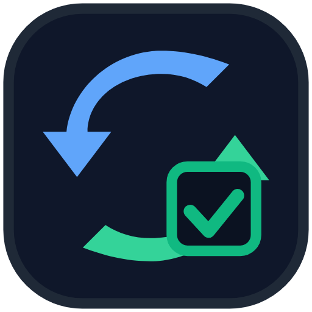
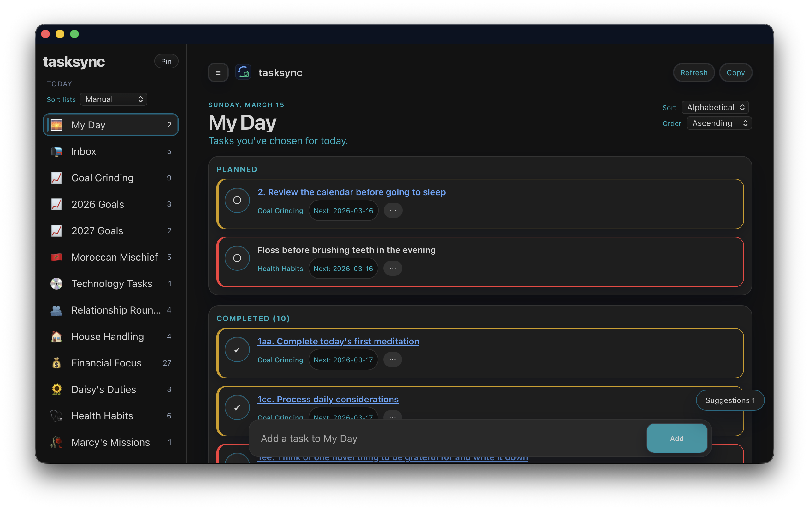
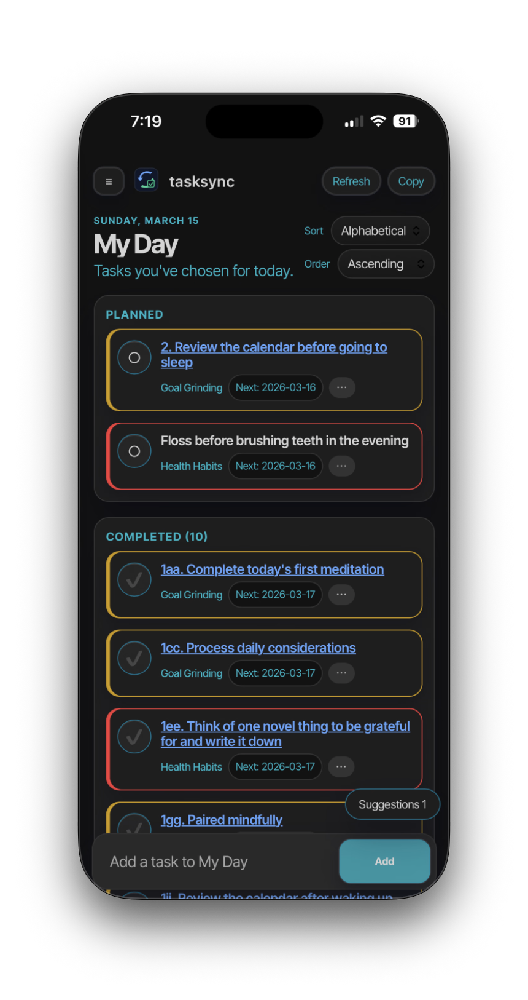

# tasksync

tasksync is a local-first, self-hosted task app built for fast daily use.

<p align="center">
    
</p>

<table>
    <tr>
        <td align="center">
            
        </td>
        <td align="center">
            
        </td>
    </tr>
</table>

If Microsoft To Do or similar apps feel slow, this project is built for the opposite: open fast, act fast, sync safely.

## What You Get

- Local-first behavior (works offline, syncs when available)
- PWA-friendly experience on iPhone and desktop
- Fast My Day workflow with recurrence, due dates, notes, and list views
- Multi-user roles (`admin`, `contributor`) with server-side role enforcement
- Admin backup/restore and simple Docker-based self-hosting

## Self-Hosting Quick Start

### 1. Prerequisites

- Docker + Docker Compose

### 2. Configure `.env`

Copy the example and edit it:

```bash
cp .env.example .env
```

At minimum, set these values in `.env`:

- `JWT_SECRET` to a long random secret
- `SEED_ADMIN_PASSWORD` and `SEED_CONTRIB_PASSWORD`
- Optional host ports: `SERVER_HOST_PORT`, `WEB_HOST_PORT`
- Optional image channel: `TASKSYNC_IMAGE_TAG` (`latest` or `beta`)

### 3. First deploy (with seed)

```bash
docker compose pull
COMPOSE_PROFILES=setup docker compose up -d
```

This starts server + web and runs one-time seed data.

Default seeded users:

- `admin@example.com` / value from `SEED_ADMIN_PASSWORD`
- `contrib@example.com` / value from `SEED_CONTRIB_PASSWORD`

### 4. Normal startup (no seed)

After first deploy, run normally:

```bash
docker compose up -d
```

### 5. Open the app

- Web: `http://localhost:5173` (or your `WEB_HOST_PORT`)
- API: `http://localhost:3000` (or your `SERVER_HOST_PORT`)

## Operating Notes

- Persistent DB data is stored in Docker volume `TASKSYNC_DATA_SOURCE` (default: `tasksync_data`).
- If running behind a reverse proxy, set `VITE_API_URL` (often `/api`) and `VITE_ALLOWED_HOSTS`.
- For multiple stacks (prod/beta), use different `TASKSYNC_DATA_SOURCE`, `SERVER_HOST_PORT`, and `WEB_HOST_PORT` values.
- `main` publishes Docker images as `latest`; non-`main` branches publish `beta`.
- To upgrade:

```bash
docker compose pull
docker compose up -d
```

- To stop:

```bash
docker compose down
```

## Local Dev (Optional)

### Prerequisites

Before running from source or using the git hooks, install:

- **Node.js 22+** — [nodejs.org](https://nodejs.org) or via [nvm](https://github.com/nvm-sh/nvm)
- **Rust (stable)** — [rustup.rs](https://rustup.rs) (installs `cargo`, `rustfmt`, `clippy`)
- **Playwright browsers** (for E2E tests) — run once after `npm install`:

```bash
cd web && npx playwright install --with-deps chromium
```

### Running from source

```bash
cd server
cargo run
```

```bash
cd web
npm install
npm run dev
```

### Git hooks (new host setup)

The repo ships pre-commit and pre-push hooks in `hooks/`. They are not installed automatically — run this once after cloning on each new machine:

```bash
ln -sf ../../hooks/pre-commit .git/hooks/pre-commit
ln -sf ../../hooks/pre-push .git/hooks/pre-push
chmod +x .git/hooks/pre-commit .git/hooks/pre-push
```

The hooks source `~/.profile` and `~/.cargo/env` automatically to pick up `npm`/`node` and `cargo`. Install the prerequisites above first — the hooks will fail with `command not found` if either tool is missing.

- **pre-commit:** lint, TypeScript check, Vitest units, `cargo fmt`, `cargo clippy`
- **pre-push:** Vitest units, Playwright smoke (Chromium), `cargo test` — set `SKIP_PLAYWRIGHT=1` to bypass E2E locally

## Project History

- This started on 2026-01-31, and by 2026-02-08 it became a fully functional system with Docker images published and a complete transition off Microsoft To Do. Built with Codex + Cursor and a tight testing/linting loop.
- Early milestone notes and roadmap are archived in `docs/exec-plans/completed/legacy-progress-and-roadmap.md`.
- For deeper technical docs, start at `docs/index.md`.

## License

[MIT](LICENSE)
