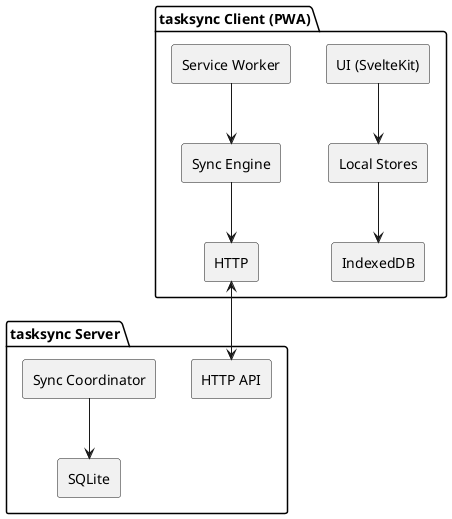

# ARCHITECTURE.md (tasksync)

> Local‑first, ultra‑fast PWA task manager with durable sync and simple self‑hosting.

## Goals (strict priority)
1. **Perceived speed** – sub‑100 ms interactions; no spinners; optimistic UI.
2. **Cross‑platform (MVP = iOS via PWA + Windows via browser/PWA)**; offline‑first.
3. **Data durability & sync safety** – local copies + safe server rendezvous.
4. **Simplicity** – one server binary; SQLite; minimal deps.
5. **Extensibility** – add without slowing the core.
6. **Multi‑user** – admin + contributor (create‑only) with list grants.

## High‑level Design
- **Client:** SvelteKit PWA (TypeScript) using IndexedDB + OPFS; WebAudio for completion sound.
- **Server:** Rust (Axum + SQLx), single static binary; SQLite (WAL).
- **Sync:** HTTP only — `POST /sync/pull` + `POST /sync/push` (protocol `delta-v1`); whole list/task rows scoped by role and list grants; incremental pull via a `since_ts` cursor (`cursor_ts` in responses). No WebSocket.
- **Conflicts:** Arrival‑order, whole‑row overwrite — the last write to reach the server wins for the fields it carries; deletes converge via tombstones; ordering via fractional order keys.

### Component Diagram (PlantUML)

```plantuml
@startuml
skinparam componentStyle rectangle
package "tasksync Client (PWA)" {
  [UI (SvelteKit)] --> [Local Stores]
  [Local Stores] --> [IndexedDB]
  [Service Worker] --> [Sync Engine]
  [Sync Engine] --> [HTTP]
}
package "tasksync Server" {
  [HTTP API]
  [Sync Coordinator]
  [SQLite]
}
[HTTP] <--> [HTTP API]
[Sync Coordinator] --> [SQLite]
@enduml
```

## Repo Layout
```
/ (root)
├─ server/                  # Rust (Axum + SQLx)
│  ├─ src/
│  ├─ migrations/
│  └─ Cargo.toml
├─ web/                     # SvelteKit PWA
│  ├─ src/
│  │  ├─ lib/
│  │  │  ├─ api/           # HTTP client + headers
│  │  │  ├─ assets/        # static imports (images, etc.)
│  │  │  ├─ components/    # UI components (Sidebar, TaskRow, etc.)
│  │  │  ├─ data/          # IndexedDB repo + persistence
│  │  │  ├─ markdown/      # import parsing (Joplin, plain text)
│  │  │  ├─ sound/         # WebAudio helper
│  │  │  ├─ stores/        # Svelte stores (tasks, settings, auth, etc.)
│  │  │  ├─ sync/          # sync coordinator + worker
│  │  │  └─ tasks/         # task domain helpers
│  │  ├─ routes/           # SvelteKit pages + layout
│  │  ├─ test/             # test utilities
│  │  └─ service-worker.ts
│  └─ static/
│     ├─ sounds/           # built-in audio assets
│     └─ streak/           # streak theme assets (per-theme manifests)
├─ shared/
│  └─ types/               # TS interfaces mirrored server↔client
├─ scripts/                # workflow scripts
├─ hooks/                  # git hooks (pre-commit, pre-push)
└─ docs/                   # system of record (see docs/index.md)
```

## Client Architecture
- **UI:** Svelte components; virtualized lists for large sets; keyboard‑first flows.
- **State:** Svelte writable/derived stores; repository layer persists to IndexedDB; background SharedWorker handles sync + indexing.
- **Search:** MiniSearch (in‑memory) for MVP; upgrade to SQLite WASM + FTS5 in V1 if needed.
- **Task references (MVP):** Tasks support `url` references only; binary task attachments were reviewed and retired due low product demand and long-term maintenance cost.
- **Audio:** Web Audio API with pre‑decoded buffers and custom-file buffer playback (gain-controlled for mobile/WebKit consistency); user settings control theme, volume, enable.
- **Pull-to-refresh:** `PullToRefresh.svelte` is a gesture-driven sync trigger entry point for mobile/PWA. It wraps `<main>` content in `+layout.svelte`, listens for touch drag gestures at the top of the scroll container, and dispatches a `refresh` event handled by the layout to initiate a sync cycle. Pure gesture utility logic (damping, threshold check, emoji selection) lives in the co-located `pullToRefreshUtils.ts`, which is independently unit-tested and imports nothing from `data/` or `stores/`.
- **Streak (combo meter):** Optional DDR-style task-completion streak. Increments on completion, breaks on punt/delete. Supports DDR (daily reset) and Endless modes. State (count, countedTaskIds, lastResetDate, dayCompleteDate) + settings persisted cross-device via `/auth/preferences` as `streak_state_json` / `streak_settings_json`. Local fast-boot cache stored under `tasksync:ui-preferences:{space}:{user}` alongside other preferences (collapsed into a single key). Theme assets (digit PNGs, streak-word PNG, judgment PNGs, announcer MP3s) declared in a per-theme `manifest.json` under `web/static/streak/{theme}/`. Announcer fires at count 5 and then probabilistically every 10–20 completions; at milestones the announcer replaces the regular completion sound for that event. Day-complete celebration fires once per calendar day when all My Day tasks are done; the `dayCompleteDate` guard syncs cross-device so multiple devices don't re-fire on the same day.
- **UI preferences:** per-user preferences (app theme, font, streak settings, sidebar state, etc.) are cached locally and synced via authenticated profile endpoints.
- **PWA install metadata:** static `manifest.webmanifest` + `apple-touch-icon`/PNG icon set in `web/static` so installed shortcuts use branded artwork on iOS/Android.
- **iOS native wrapper (Capacitor):** Optional native iOS shell that loads the SvelteKit PWA inside WKWebView. Solves iOS Safari's 7-day IDB eviction by running in a native app sandbox. Adds a configurable server URL setting for self-hosted users. Lives in `web/ios/` (Xcode project) with `web/capacitor.config.ts`. No business logic in Swift; the native layer is purely a container.

## Server Architecture
- **Axum** web server; **SQLx** to SQLite (WAL). Pragmas: `journal_mode=WAL`, `synchronous=NORMAL`.
- **Files:** No general task file object store in MVP; server persists task metadata and user sound/profile metadata.
- **Auth:** JWT (HS256) per user; device `client_id` per installation; all endpoints behind TLS. Sessions carry a `tv` (token_version) claim (`#[serde(default)]`, so legacy tokens without the claim read `tv=0`); the existing per-request identity lookup (`membership JOIN user`, no additional round-trip) compares the claim against the stored `user.token_version` and returns `401` on mismatch. Revocation therefore lands on the **next server contact**; an already-authenticated device stays usable offline in between, so the Performance Budgets below are unaffected.
- **Login wall / first-run setup:** `GET /auth/status` (unauthenticated) returns `{ owner_exists: bool }`; `POST /auth/setup` (unauthenticated, self-guarded) provisions the first admin/owner — space, user, and admin membership — when none exists, returning `201 CREATED` with a login-shaped body (`{ token, user_id, email, display, avatar_icon, space_id, role }`), or `409` once an admin already exists. The client renders a full-screen `LoginWall` (first-run setup form when `owner_exists=false`, otherwise a login form) before any app shell, Sidebar, or task content paints, replacing the previous menu-first/Sidebar-embedded login flow; the gate keys off `$auth.status`, which resolves to `authenticated` from a cached token+user on a network (non-401) failure, so offline cold boot for an already-authenticated device is unaffected. `DEV_LOGIN_PASSWORD` (the previous shared-fallback login for hash-less accounts) has been removed — auth is hash-only (a missing hash fails authentication) and `POST /auth/setup` is now the sole owner-provisioning path; the boot preflight no longer mandates `DEV_LOGIN_PASSWORD` but still fails closed on an unset `JWT_SECRET`.
- **Session revocation:** `POST /auth/revoke-sessions` (authenticated) bumps the caller's own `token_version` and re-issues a fresh token for the *acting* device, returning `200 { token }` — contract is **swap-and-stay**: the calling device remains signed in on the new token, while the caller's *other* sessions are invalidated on their next server contact. `PATCH /auth/password` returns `200 { token }` (previously `204`): a self password change bumps the caller's `token_version` and the response token keeps the acting device signed in; the admin-only `auth_set_member_password` bumps the *target* user's `token_version` only, leaving the admin's own session untouched.
- **Programmatic task-creation API:** `POST /api/tasks` authenticates via the `X-TaskSync-Api-Token` request header checked against the optional `TASK_API_TOKEN` env var (min length 24 chars, validated fail-closed at boot when set); when `TASK_API_TOKEN` is unset the route returns `404` (feature off). A valid token resolves the single owner/admin identity server-side (the caller cannot choose a `uid`) with a create-task-only scope (`ApiTaskCreate`) that is rejected on read/admin endpoints (`/auth/members`, task reads). Created tasks flow through the same shared, idempotent create path the browser uses — a client-supplied stable id makes retries idempotent, and created tasks reappear on `/sync/pull` — so no new branching sync behavior is introduced.
- **User media/settings:** `/auth/sound` persists per-user sound + profile media metadata server-side for cross-device consistency.
- **User UI preferences:** `/auth/preferences` persists per-user app theme and sidebar panel-collapse state for cross-device consistency.
- **Backup/restore:** admin-only `/auth/backup` export/import provides versioned space snapshots (space, users, memberships, lists, grants, tasks) for disaster recovery.

## Data Model (abridged)
```
ID = ulid | TS = ms
Task { id, title, notes?, url?, due?, start?, scheduled?, priority(0..3), status(pending|done|cancelled), list_id, project_id?, area_id?, tags:Set<ID>, checklist:[ChecklistItem], order, recurrence_id?, recur_state?, punted_from_due_date?, punted_on_date?, created_ts, updated_ts }
ChecklistItem { id, title, done, order }
List { id, name, order }
Project { id, name, order }
Area { id, name, order }
Tag { id, name, color? }
RecurrenceRule { id, rrule, timezone, skip_dates:[date] }
RecurrenceState { last_instance_dt?, last_gen_dt }
User { id, email, display, password_hash, token_version }
Space { id, name }
Membership { id, space_id, user_id, role:('admin'|'contributor') }
ListGrant { id, space_id, list_id, user_id }
UserSettings { user_id PK, sound_enabled bool, sound_volume 0..100, sound_theme, custom_sound_file_id?, custom_sound_file_name?, custom_sound_data_url?, profile_attachments_json? }
UserPreferences { user_id PK, ui_theme, ui_font?, ui_sidebar_panels?, ui_list_sort?, ui_completion_quotes?, streak_settings_json?, streak_state_json? }
```

`User.token_version` (migration `0017_user_token_version.sql`, `integer not null default 0`) backs the session-revocation model described under Server Architecture above — it is bumped on a self password change and on `/auth/revoke-sessions`, and compared against each session JWT's `tv` claim on every request.

### Key Tables (SQL snippets)
```sql
create table if not exists membership (
  id text primary key,
  space_id text not null,
  user_id text not null,
  role text not null check (role in ('admin','contributor'))
);
create table if not exists list_grant (
  id text primary key,
  space_id text not null,
  list_id text not null,
  user_id text not null
);
```

## Sync Protocol (current implementation: `delta-v1`)
- **Transport:** HTTP only — `POST /sync/pull` and `POST /sync/push`, both authenticated like every other endpoint. There is no WebSocket; remote updates arrive on the next pull.
- **Pull:** request `{ since_ts? }` → response `{ protocol: "delta-v1", cursor_ts, lists[], tasks[], deleted_tasks[] }`. Rows are whole `ListRow`/`TaskRow` records scoped by role and list grants (admins see the whole space; contributors see granted lists). Lists are always a full snapshot; when `since_ts` is supplied, tasks are filtered to `updated_ts >= since_ts` and deletions to tombstones with `deleted_ts >= since_ts`. `cursor_ts` = max(task `updated_ts`, tombstone `deleted_ts`) within the caller's scope; the client sends it back as the next `since_ts`.
- **Push:** request `{ changes[] }` — up to 500 changes per request (larger batches are rejected with `400`). Each change is `create_task` / `update_task` / `update_task_status` carrying a client‑generated `op_id`, applied sequentially through the same code paths (and role/grant checks) as the REST endpoints. Response `{ protocol, cursor_ts, applied[], rejected[] }`: per‑op failures are reported in `rejected[]` keyed by `op_id`; `applied[]` is a positional list of resulting task rows, **not** keyed by `op_id` (known limitation, deferred to a future sync‑contract revision).
- **Idempotency:** client‑supplied task ids make re‑pushed creates converge (unique violation → the existing row is returned, `200` instead of `201`); updates are absolute‑value writes, so replays are no‑ops; re‑pulls are pure reads.
- **Client cursor:** the client sync coordinator (`web/src/lib/sync/sync.ts`) keeps its pull cursor in memory only — it resets on every app launch, so a cold start performs a full pull.

### Conflict Rules (current implementation)
- **Arrival‑order, whole‑row overwrite:** the last write to **reach the server** wins for the fields it carries. `update_task_meta` applies `coalesce(?, column)` per column, so omitted optional fields are preserved and provided fields overwrite unconditionally. (Exceptions: the punt fields `punted_from_due_date`/`punted_on_date` are written unconditionally, and status transitions manage `completed_ts`.) There is no comparison of client vs server timestamps, no version vectors, no per‑field LWW by logical clock, and no tiebreak rule.
- **Deletes:** converge via `task_tombstone` rows; a create for a tombstoned id clears the tombstone (deliberate resurrect‑on‑create).
- **Order:** fractional order keys (`b`, `bm`, `bmx`, …) for stable concurrent inserts.

## Recurrence (RRULE subset)
- Support: `FREQ`, `BYDAY`, `BYMONTHDAY`, `BYSETPOS`, `INTERVAL`, `UNTIL`, `COUNT` + helpers (nth weekday, last weekday, business days).
- UI presets currently include `daily`, `weekdays`, `weekly`, `biweekly`, `monthly`, `quarterly`, `biannual`, and `annual`.
- **Materialize on demand** within [today‑Δ, today+Δ] (Δ≈14 days) and update `recur_state`.

## My Day (materialization + scoring)
- Include: overdue, due today, scheduled today, and instances from recurring templates.
- Score: priority weight + overdue bucket + pins; order with fractional keys.
- Rollover behavior: overdue pending items are surfaced in a dedicated **Missed** bucket with direct resolve actions (skip next recurrence, mark done, delete).
- Due date / My Day membership rule: setting a future due date on a task removes it from My Day (`my_day = false`). Setting today's date or a past date (overdue) leaves My Day membership unchanged. This rule is enforced in `setDueDate` (store) and via a reactive guard in `TaskDetailDrawer`.
- Recurring completion behavior: when a recurring task is completed, it can appear in **Completed** for the current day while the next due instance is already materialized.
- Recurring completion undo behavior: from **Completed**, users can undo a same-day recurring completion, restoring the prior due date/occurrence count instead of creating another future roll-forward.
- Recurring sync behavior: explicit completion timestamps are preserved even when the rolled-forward task remains `pending`, so same-day completion acknowledgment survives sync and naturally clears at day rollover.
- Punt behavior: punting is instance-scoped (not series-wide), moves a due-today pending task to tomorrow, and is sync-safe through persisted punt metadata (`punted_from_due_date`, `punted_on_date`) carried across pull/push; punted tasks are treated as addressed in today's My Day Completed bucket, then surface as pending on their next due day with a punt indicator, and daily recurrences are excluded from punt.

## Completion Sound
- Built‑ins: `chime_soft`, `click_pop`, `sparkle_short`, `wood_tick` (≤150KB each).
- User settings: enable/mute, volume, theme, optional custom upload (single or multi-file playlist with randomized playback when using `custom_file`).
- Performance: **<20 ms** input→audio onset (pre‑decoded buffers).
- Reliability: playback path rebuilds stale/suspended WebAudio contexts when resume fails (notably iOS/macOS/WebKit PWA lifecycle interruptions); standalone PWA contexts (iOS and macOS) are aggressively recycled after 2 minutes of idle.

## Performance Budgets
- Startup (cold PWA): **<800 ms** TTI; first list render **<300 ms** (1k tasks).
- Interaction paint: **<50 ms**; open task detail **<80 ms**.
- Search: **<100 ms** for 10k local tasks.
- Sync ack: **<500 ms** WAN typical (background).

## Backup and Restore
- Backup format: versioned JSON snapshot (`tasksync-space-backup-v1`) with explicit schema + export timestamp.
- Scope: full space data (including memberships and per-user sound/profile media metadata), intended for admin-controlled operational recovery.
- Restore semantics: replace space-scoped list/task/grant/membership data from snapshot while preserving referential integrity through transactional apply.

## Roadmap
- **MVP**: PWA shell, local stores + IndexedDB/OPFS, CRUD, recurrence, My Day, single‑binary server, sync, role model (admin/contributor create‑only), completion sounds.
- **V1**: Multi‑user spaces, invites, E2EE (optional), SQLite WASM + FTS5, natural‑language add.
- **V2**: Plugin API, collaborative notes, optional native wrappers, push/background sync.

### Future sync protocol (aspirational — not implemented)

The following design is preserved from the original architecture sketch. None of it exists in the current implementation — there is no `change` table in any migration, no WebSocket endpoint, and no version‑vector bookkeeping. The protocol actually in use is described in "Sync Protocol" above.

- **Changesets:** append‑only changesets + per‑entity version vector.
- **Hello:** client→server `client_id`, `since`, `known_server_vv`.
- **Delta:** server→client `{changes[], server_vv}` (scoped by role and grants).
- **Push:** client→server `{changes[]}` (server validates role; contributors may only create tasks in granted lists).
- **Live:** WebSocket for streaming updates; HTTP polling fallback.
- **Conflict rules:** per‑field LWW using `{logical_ts, client_id}`, tie by `client_id` lexicographically; sets = union with tombstones for removals; notes full‑field replace initially, consider CRDT later if collaboration needed.
- **Change entity:**

```
Change { id, entity, entity_id, field_deltas:json, vv:json, client_id, ts, actor_user_id }
```

```sql
create table if not exists change (
  id text primary key,
  space_id text not null,
  entity text not null,
  entity_id text not null,
  field_deltas text not null,
  vv text not null,
  client_id text not null,
  ts integer not null,
  actor_user_id text not null
);
```
