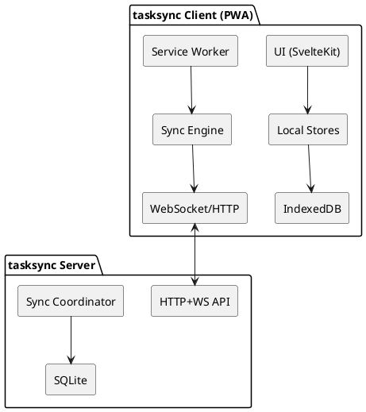

# ARCHITECTURE.md (tasksync)

> Local‑first, ultra‑fast PWA task manager with durable sync and simple self‑hosting.

## Goals (strict priority)
1. **Perceived speed** – sub‑100 ms interactions; no spinners; optimistic UI.
2. **Cross‑platform (MVP = iOS via PWA + Windows via browser/PWA)**; offline‑first.
3. **Data durability & sync safety** – local copies + safe server rendezvous.
4. **Simplicity** – one server binary; SQLite; minimal deps.
5. **Extensibility** – add without slowing the core.
6. **Multi‑user** – admin + contributor (create‑only) with list grants.

## High‑level Design
- **Client:** SvelteKit PWA (TypeScript) using IndexedDB + OPFS; WebAudio for completion sound.
- **Server:** Rust (Axum + SQLx), single static binary; SQLite (WAL).
- **Sync:** Append‑only changesets + per‑entity version vector; WS live sync, HTTP fallback.
- **Conflicts:** Per‑field LWW + deterministic tiebreak; sets=union+tombstones; ordering via fractional indexes.

### Component Diagram (PlantUML)

```plantuml
@startuml
skinparam componentStyle rectangle
package "tasksync Client (PWA)" {
  [UI (SvelteKit)] --> [Local Stores]
  [Local Stores] --> [IndexedDB]
  [Service Worker] --> [Sync Engine]
  [Sync Engine] --> [WebSocket/HTTP]
}
package "tasksync Server" {
  [HTTP+WS API]
  [Sync Coordinator]
  [SQLite]
}
[WebSocket/HTTP] <--> [HTTP+WS API]
[Sync Coordinator] --> [SQLite]
@enduml
```

## Repo Layout
```
/ (root)
├─ server/               # Rust (Axum + SQLx)
│  ├─ src/
│  ├─ migrations/
│  └─ Cargo.toml
├─ web/                  # SvelteKit PWA
│  ├─ src/
│  │  ├─ lib/
│  │  │  ├─ sound/      # WebAudio helper
│  │  │  └─ stores/     # Svelte stores (tasks, settings, sync, search)
│  │  ├─ routes/
│  │  │  ├─ settings/
│  │  │  └─ (app pages)
│  │  └─ components/
│  ├─ static/sounds/     # built‑in audio assets
│  └─ service-worker.ts
├─ shared/
│  └─ types/             # TS interfaces mirrored server↔client
└─ docs/
   ├─ ARCHITECTURE.md
   └─ AGENTS.md
```

## Client Architecture
- **UI:** Svelte components; virtualized lists for large sets; keyboard‑first flows.
- **State:** Svelte writable/derived stores; repository layer persists to IndexedDB; background SharedWorker handles sync + indexing.
- **Search:** MiniSearch (in‑memory) for MVP; upgrade to SQLite WASM + FTS5 in V1 if needed.
- **Task references (MVP):** Tasks support `url` references only; binary task attachments were reviewed and retired due low product demand and long-term maintenance cost.
- **Audio:** Web Audio API with pre‑decoded buffers and custom-file buffer playback (gain-controlled for mobile/WebKit consistency); user settings control theme, volume, enable.
- **UI preferences:** per-user preferences (app theme + sidebar panel collapse state) are cached locally and synced via authenticated profile endpoints.
- **PWA install metadata:** static `manifest.webmanifest` + `apple-touch-icon`/PNG icon set in `web/static` so installed shortcuts use branded artwork on iOS/Android.

## Server Architecture
- **Axum** web server; **SQLx** to SQLite (WAL). Pragmas: `journal_mode=WAL`, `synchronous=NORMAL`.
- **Files:** No general task file object store in MVP; server persists task metadata and user sound/profile metadata.
- **Auth:** JWT (HS256) per user; device `client_id` per installation; all endpoints behind TLS.
- **User media/settings:** `/auth/sound` persists per-user sound + profile media metadata server-side for cross-device consistency.
- **User UI preferences:** `/auth/preferences` persists per-user app theme and sidebar panel-collapse state for cross-device consistency.
- **Backup/restore:** admin-only `/auth/backup` export/import provides versioned space snapshots (space, users, memberships, lists, grants, tasks) for disaster recovery.

## Data Model (abridged)
```
ID = ulid | TS = ms
Task { id, title, notes?, url?, due?, start?, scheduled?, priority(0..3), status(pending|done|cancelled), list_id, project_id?, area_id?, tags:Set<ID>, checklist:[ChecklistItem], order, recurrence_id?, recur_state?, punted_from_due_date?, punted_on_date?, created_ts, updated_ts }
ChecklistItem { id, title, done, order }
List { id, name, order }
Project { id, name, order }
Area { id, name, order }
Tag { id, name, color? }
RecurrenceRule { id, rrule, timezone, skip_dates:[date] }
RecurrenceState { last_instance_dt?, last_gen_dt }
Change { id, entity, entity_id, field_deltas:json, vv:json, client_id, ts, actor_user_id }
User { id, email, display, password_hash }
Space { id, name }
Membership { id, space_id, user_id, role:('admin'|'contributor') }
ListGrant { id, space_id, list_id, user_id }
UserSettings { user_id PK, sound_enabled bool, sound_volume 0..100, sound_theme, custom_sound_file_id?, custom_sound_file_name?, custom_sound_data_url?, profile_attachments_json? }
```

### Key Tables (SQL snippets)
```sql
create table if not exists membership (
  id text primary key,
  space_id text not null,
  user_id text not null,
  role text not null check (role in ('admin','contributor'))
);
create table if not exists list_grant (
  id text primary key,
  space_id text not null,
  list_id text not null,
  user_id text not null
);
create table if not exists change (
  id text primary key,
  space_id text not null,
  entity text not null,
  entity_id text not null,
  field_deltas text not null,
  vv text not null,
  client_id text not null,
  ts integer not null,
  actor_user_id text not null
);
```

## Sync Protocol (concise)
- **Hello:** client→server `client_id`, `since`, `known_server_vv`.
- **Delta:** server→client `{changes[], server_vv}` (scoped by role and grants).
- **Push:** client→server `{changes[]}` (server validates role; contributors may only create tasks in granted lists).
- **Live:** WebSocket for streaming updates; HTTP polling fallback.

### Conflict Rules
- **Per‑field LWW** using `{logical_ts, client_id}`; tie by `client_id` lexicographically.
- **Order:** fractional order keys (`b`, `bm`, `bmx`, …) for stable concurrent inserts.
- **Sets:** union with tombstones for removals.
- **Notes:** full‑field replace in MVP; consider CRDT in V1 if collaboration needed.

## Recurrence (RRULE subset)
- Support: `FREQ`, `BYDAY`, `BYMONTHDAY`, `BYSETPOS`, `INTERVAL`, `UNTIL`, `COUNT` + helpers (nth weekday, last weekday, business days).
- UI presets currently include `daily`, `weekdays`, `weekly`, `biweekly`, `monthly`, `quarterly`, `biannual`, and `annual`.
- **Materialize on demand** within [today‑Δ, today+Δ] (Δ≈14 days) and update `recur_state`.

## My Day (materialization + scoring)
- Include: overdue, due today, scheduled today, and instances from recurring templates.
- Score: priority weight + overdue bucket + pins; order with fractional keys.
- Rollover behavior: overdue pending items are surfaced in a dedicated **Missed** bucket with direct resolve actions (skip next recurrence, mark done, delete).
- Recurring completion behavior: when a recurring task is completed, it can appear in **Completed** for the current day while the next due instance is already materialized.
- Recurring completion undo behavior: from **Completed**, users can undo a same-day recurring completion, restoring the prior due date/occurrence count instead of creating another future roll-forward.
- Recurring sync behavior: explicit completion timestamps are preserved even when the rolled-forward task remains `pending`, so same-day completion acknowledgment survives sync and naturally clears at day rollover.
- Punt behavior: punting is instance-scoped (not series-wide), moves a due-today pending task to tomorrow, and is sync-safe through persisted punt metadata (`punted_from_due_date`, `punted_on_date`) carried across pull/push; punted tasks are treated as addressed in today's My Day Completed bucket, then surface as pending on their next due day with a punt indicator, and daily recurrences are excluded from punt.

## Completion Sound
- Built‑ins: `chime_soft`, `click_pop`, `sparkle_short`, `wood_tick` (≤150KB each).
- User settings: enable/mute, volume, theme, optional custom upload (single or multi-file playlist with randomized playback when using `custom_file`).
- Performance: **<20 ms** input→audio onset (pre‑decoded buffers).
- Reliability: playback path rebuilds stale/suspended WebAudio contexts when resume fails (notably mobile/WebKit PWA lifecycle interruptions).

## Performance Budgets
- Startup (cold PWA): **<800 ms** TTI; first list render **<300 ms** (1k tasks).
- Interaction paint: **<50 ms**; open task detail **<80 ms**.
- Search: **<100 ms** for 10k local tasks.
- Sync ack: **<500 ms** WAN typical (background).

## Backup and Restore
- Backup format: versioned JSON snapshot (`tasksync-space-backup-v1`) with explicit schema + export timestamp.
- Scope: full space data (including memberships and per-user sound/profile media metadata), intended for admin-controlled operational recovery.
- Restore semantics: replace space-scoped list/task/grant/membership data from snapshot while preserving referential integrity through transactional apply.

## Roadmap
- **MVP**: PWA shell, local stores + IndexedDB/OPFS, CRUD, recurrence, My Day, single‑binary server, sync, role model (admin/contributor create‑only), completion sounds.
- **V1**: Multi‑user spaces, invites, E2EE (optional), SQLite WASM + FTS5, natural‑language add.
- **V2**: Plugin API, collaborative notes, optional native wrappers, push/background sync.
